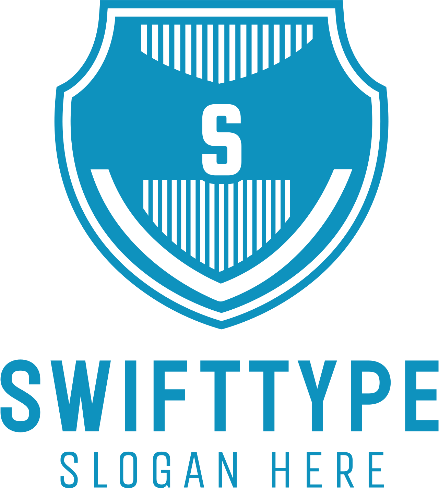

# 🧠 SwiftType

<p align="center">
  
</p>

A modern, interactive typing tutor built in Python using Tkinter. It helps users practice typing, track progress, and visualize performance through a built-in dashboard.

---

## 🚀 Features

- 👤 Multiple user profiles with saved session history
- ⏱️ Timed typing practice with real-time feedback
- ✅ Highlights correct and incorrect keystrokes (green/red)
- 📊 Dashboard showing:
  - Session history (timestamp, WPM, accuracy, errors)
  - Cumulative stats (average WPM, accuracy, errors)
- 📚 Randomized typing lessons
- 💾 Persistent data storage in JSON files
- 🧹 Ability to clear session history
- 🌐 Modern UI using `ttk` widgets

---

## 🖥️ Screenshots

*(Add screenshots here if you want)*

---

## 📦 Installation (Developer Mode)

### 1. Clone the repository
```bash
git clone https://github.com/TUBUNJANA/SwiftType.git
cd SwiftType
